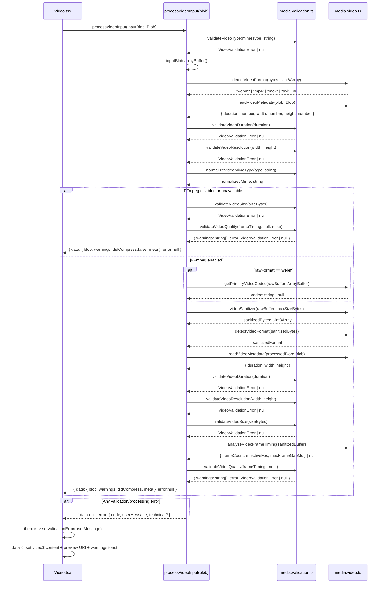
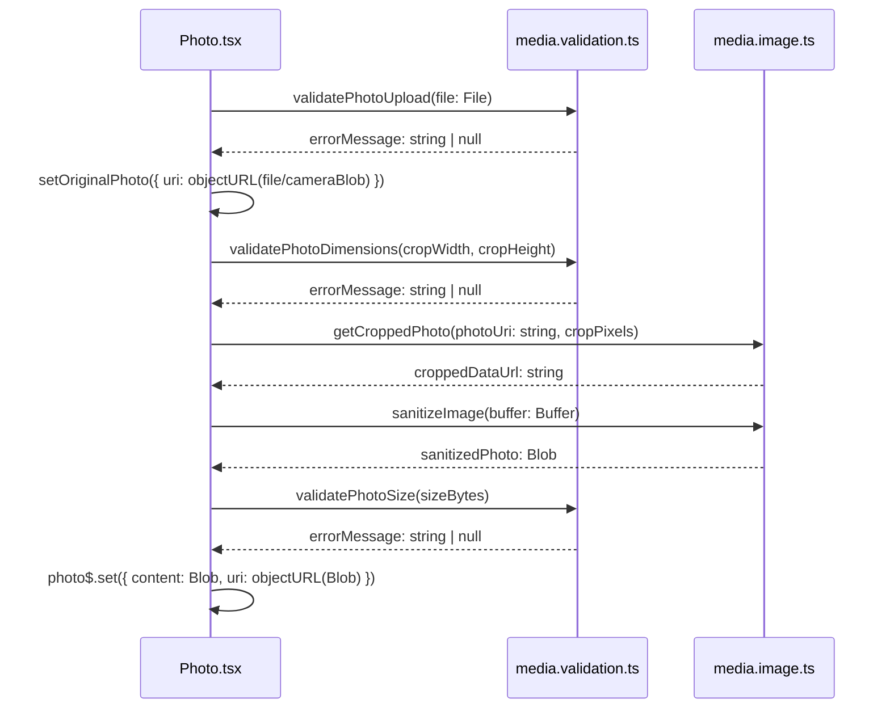

# Media Function Call Flow (With Data Exchanged)

## Video Flow

```mermaid
sequenceDiagram
    participant UI as Video.tsx
    participant Pipe as processVideoInput(blob)
    participant Val as media.validation.ts
    participant Vid as media.video.ts

    UI->>Pipe: processVideoInput(inputBlob: Blob)

    Pipe->>Val: validateVideoType(mimeType: string)
    Val-->>Pipe: VideoValidationError | null

    Pipe->>Pipe: inputBlob.arrayBuffer()
    Pipe->>Vid: detectVideoFormat(bytes: Uint8Array)
    Vid-->>Pipe: "webm" | "mp4" | "mov" | "avi" | null

    Pipe->>Vid: readVideoMetadata(blob: Blob)
    Vid-->>Pipe: { duration: number, width: number, height: number }

    Pipe->>Val: validateVideoDuration(duration)
    Val-->>Pipe: VideoValidationError | null
    Pipe->>Val: validateVideoResolution(width, height)
    Val-->>Pipe: VideoValidationError | null

    Pipe->>Val: normalizeVideoMimeType(type: string)
    Val-->>Pipe: normalizedMime: string

    alt FFmpeg disabled or unavailable
        Pipe->>Val: validateVideoSize(sizeBytes)
        Val-->>Pipe: VideoValidationError | null
        Pipe->>Val: validateVideoQuality(frameTiming: null, meta)
        Val-->>Pipe: { warnings: string[], error: VideoValidationError | null }
        Pipe-->>UI: { data: { blob, warnings, didCompress:false, meta }, error:null }
    else FFmpeg enabled
        alt rawFormat == webm
            Pipe->>Vid: getPrimaryVideoCodec(rawBuffer: ArrayBuffer)
            Vid-->>Pipe: codec: string | null
        end

        Pipe->>Vid: videoSanitizer(rawBuffer, maxSizeBytes)
        Vid-->>Pipe: sanitizedBytes: Uint8Array

        Pipe->>Vid: detectVideoFormat(sanitizedBytes)
        Vid-->>Pipe: sanitizedFormat

        Pipe->>Vid: readVideoMetadata(processedBlob: Blob)
        Vid-->>Pipe: { duration, width, height }

        Pipe->>Val: validateVideoDuration(duration)
        Val-->>Pipe: VideoValidationError | null
        Pipe->>Val: validateVideoResolution(width, height)
        Val-->>Pipe: VideoValidationError | null
        Pipe->>Val: validateVideoSize(sizeBytes)
        Val-->>Pipe: VideoValidationError | null

        Pipe->>Vid: analyzeVideoFrameTiming(sanitizedBuffer)
        Vid-->>Pipe: { frameCount, effectiveFps, maxFrameGapMs } | null

        Pipe->>Val: validateVideoQuality(frameTiming, meta)
        Val-->>Pipe: { warnings: string[], error: VideoValidationError | null }

        Pipe-->>UI: { data: { blob, warnings, didCompress, meta }, error:null }
    end

    alt Any validation/processing error
        Pipe-->>UI: { data:null, error: { code, userMessage, technical? } }
    end

    UI->>UI: if error -> setValidationError(userMessage)
    UI->>UI: if data -> set video$ content + preview URI + warnings toast
```

## Photo Flow

```mermaid
sequenceDiagram
    participant UI as Photo.tsx
    participant Val as media.validation.ts
    participant Img as media.image.ts

    UI->>Val: validatePhotoUpload(file: File)
    Val-->>UI: errorMessage: string | null

    UI->>UI: setOriginalPhoto({ uri: objectURL(file/cameraBlob) })

    UI->>Val: validatePhotoDimensions(cropWidth, cropHeight)
    Val-->>UI: errorMessage: string | null

    UI->>Img: getCroppedPhoto(photoUri: string, cropPixels)
    Img-->>UI: croppedDataUrl: string

    UI->>Img: sanitizeImage(buffer: Buffer)
    Img-->>UI: sanitizedPhoto: Blob

    UI->>Val: validatePhotoSize(sizeBytes)
    Val-->>UI: errorMessage: string | null

    UI->>UI: photo$.set({ content: Blob, uri: objectURL(Blob) })
```
